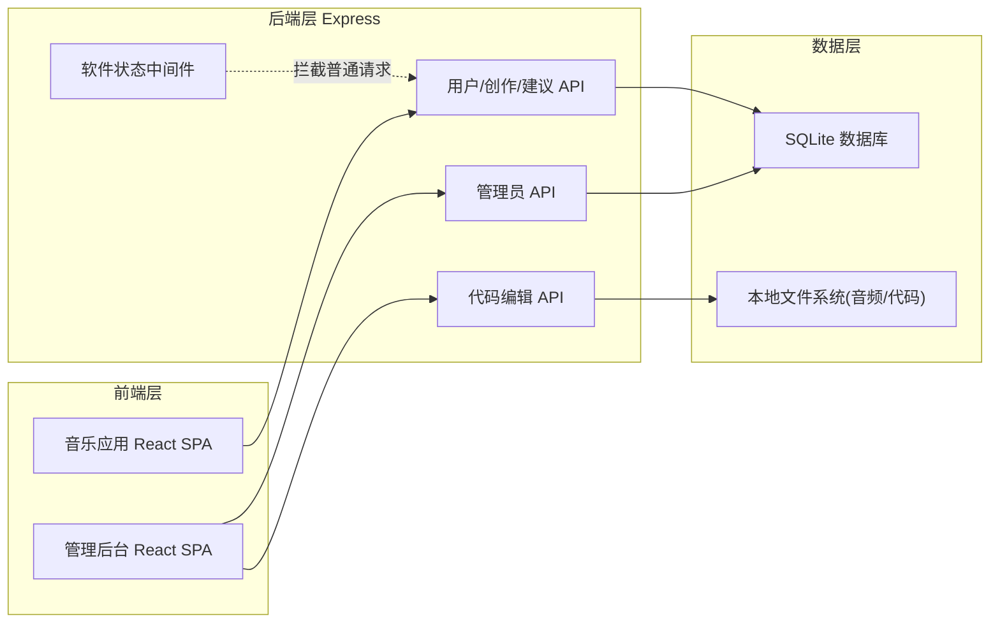
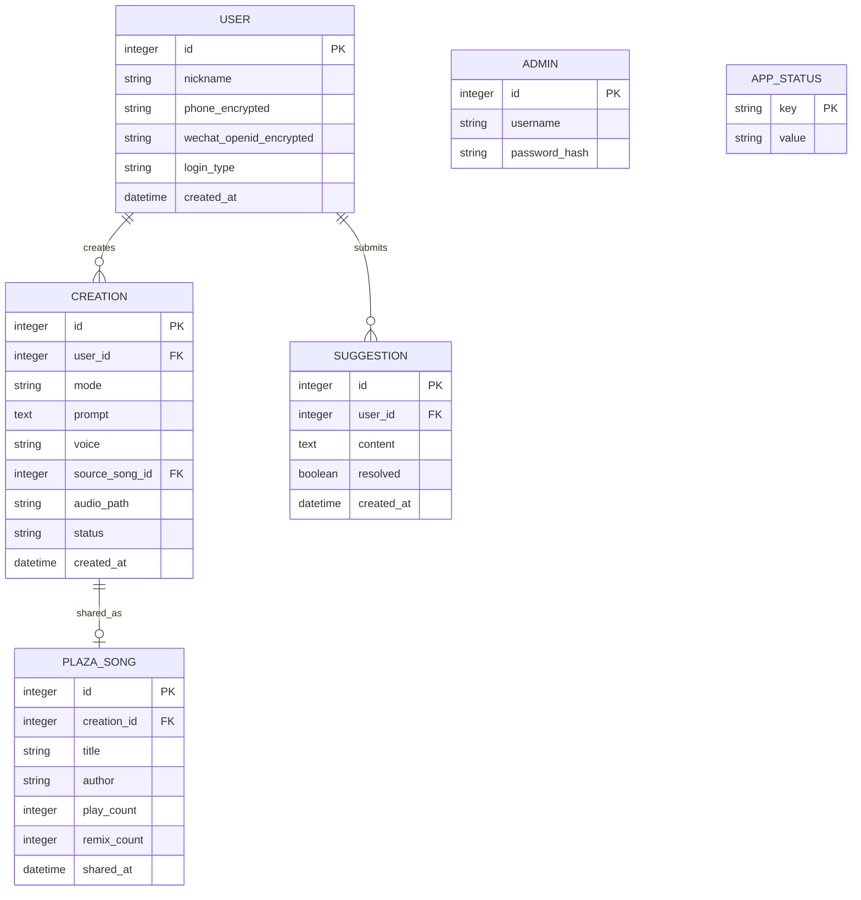

# 技术架构文档

## 1. 架构设计



## 2. 技术说明
- **前端**：React@18 + tailwindcss@3 + vite
- **初始化工具**：vite-init（React + JavaScript 模板）
- **后端**：Express@4（独立 server 目录，提供 REST API）
- **数据库**：SQLite（better-sqlite3，零依赖文件型数据库，适合演示与本地部署）
- **音频处理**：前端 Web Audio API 模拟生成（演示用，不依赖外部 AI 服务）
- **图标**：lucide-react
- **动画**：CSS 动画 + framer-motion

## 3. 路由定义

### 3.1 前端路由（音乐应用）
| 路由 | 用途 |
|-------|---------|
| / | 编辑歌曲主页 |
| /plaza | 歌曲广场 |
| /profile | 个人中心 |
| /maintenance | 软件暂停维护页 |

### 3.2 前端路由（管理后台）
| 路由 | 用途 |
|-------|---------|
| /admin | 管理后台登录 |
| /admin/dashboard | 用户/建议/暂停管理 |
| /admin/code | 代码查看编辑 |

## 4. API 定义

### 4.1 普通用户 API
```typescript
// 用户登录
POST /api/auth/login
  body: { type: 'wechat' | 'phone', phone?: string, code?: string }
  res: { token: string, user: { id, nickname, phoneMasked } }

// 提交创作
POST /api/creations
  body: { mode: 'original'|'lyrics'|'pure', prompt: string, voice?: 'male'|'female', sourceSongId?: string }
  res: { id, status: 'processing' }

// 查询创作状态
GET /api/creations/:id
  res: { id, status, audioUrl?, progress }

// 我的创作列表
GET /api/creations/mine
  res: Creation[]

// 广场列表
GET /api/plaza
  res: Song[]

// 分享到广场
POST /api/creations/:id/share
  res: { plazaId }

// 提交建议
POST /api/suggestions
  body: { content: string }
  res: { id }

// 软件状态（无需鉴权）
GET /api/status
  res: { active: boolean }
```

### 4.2 管理员 API
```typescript
// 管理员登录
POST /api/admin/login
  body: { username, password }
  res: { token }

// 用户列表（脱敏）
GET /api/admin/users
  res: User[]  // phone 已脱敏

// 建议列表
GET /api/admin/suggestions
  res: Suggestion[]

// 暂停/恢复软件
POST /api/admin/toggle-status
  body: { active: boolean }
  res: { active }

// 代码文件列表
GET /api/admin/code/files
  res: { path, name }[]

// 读取代码文件
GET /api/admin/code/file?path=xxx
  res: { content: string }

// 保存代码文件
PUT /api/admin/code/file
  body: { path, content }
  res: { ok: true }
```

## 5. 服务器架构图

```mermaid
flowchart TD
    "客户端请求" --> "状态中间件(暂停检查)"
    "状态中间件(暂停检查)" -->|活跃| "路由分发"
    "状态中间件(暂停检查)" -->|暂停| "返回维护页"
    "路由分发" --> "Auth 中间件"
    "Auth 中间件" --> "Controller"
    "Controller" --> "Service"
    "Service" --> "Repository(better-sqlite3)"
    "Repository(better-sqlite3)" --> "SQLite 文件"
```

## 6. 数据模型

### 6.1 数据模型定义



### 6.2 数据定义语言（DDL）

```sql
CREATE TABLE IF NOT EXISTS user (
  id INTEGER PRIMARY KEY AUTOINCREMENT,
  nickname TEXT NOT NULL,
  phone_encrypted TEXT,
  wechat_openid_encrypted TEXT,
  login_type TEXT NOT NULL CHECK(login_type IN ('wechat','phone')),
  created_at DATETIME DEFAULT CURRENT_TIMESTAMP
);

CREATE TABLE IF NOT EXISTS creation (
  id INTEGER PRIMARY KEY AUTOINCREMENT,
  user_id INTEGER NOT NULL,
  mode TEXT NOT NULL CHECK(mode IN ('original','lyrics','pure')),
  prompt TEXT,
  voice TEXT CHECK(voice IN ('male','female') OR voice IS NULL),
  source_song_id INTEGER,
  audio_path TEXT,
  status TEXT DEFAULT 'processing',
  created_at DATETIME DEFAULT CURRENT_TIMESTAMP,
  FOREIGN KEY(user_id) REFERENCES user(id)
);

CREATE TABLE IF NOT EXISTS plaza_song (
  id INTEGER PRIMARY KEY AUTOINCREMENT,
  creation_id INTEGER NOT NULL,
  title TEXT NOT NULL,
  author TEXT NOT NULL,
  cover_color TEXT,
  play_count INTEGER DEFAULT 0,
  remix_count INTEGER DEFAULT 0,
  shared_at DATETIME DEFAULT CURRENT_TIMESTAMP,
  FOREIGN KEY(creation_id) REFERENCES creation(id)
);

CREATE TABLE IF NOT EXISTS suggestion (
  id INTEGER PRIMARY KEY AUTOINCREMENT,
  user_id INTEGER NOT NULL,
  content TEXT NOT NULL,
  resolved INTEGER DEFAULT 0,
  created_at DATETIME DEFAULT CURRENT_TIMESTAMP,
  FOREIGN KEY(user_id) REFERENCES user(id)
);

CREATE TABLE IF NOT EXISTS admin (
  id INTEGER PRIMARY KEY AUTOINCREMENT,
  username TEXT UNIQUE NOT NULL,
  password_hash TEXT NOT NULL
);

CREATE TABLE IF NOT EXISTS app_status (
  key TEXT PRIMARY KEY,
  value TEXT NOT NULL
);

-- 初始数据：管理员账号 admin / admin123（演示用，密码哈希存储）
INSERT OR IGNORE INTO admin (username, password_hash) VALUES ('admin', 'admin123');
INSERT OR IGNORE INTO app_status (key, value) VALUES ('active', 'true');
```

## 7. 隐私保护实现要点
- 手机号入库前用 AES 加密，出库脱敏（保留前3后4）
- 微信 openid 同样加密存储，仅返回昵称
- 管理员密码使用 bcrypt 哈希（演示用明文简化，标注 TODO）
- 所有 /api/admin/* 接口强制 JWT 鉴权
- 代码编辑接口限制可访问目录白名单，防止目录穿越
